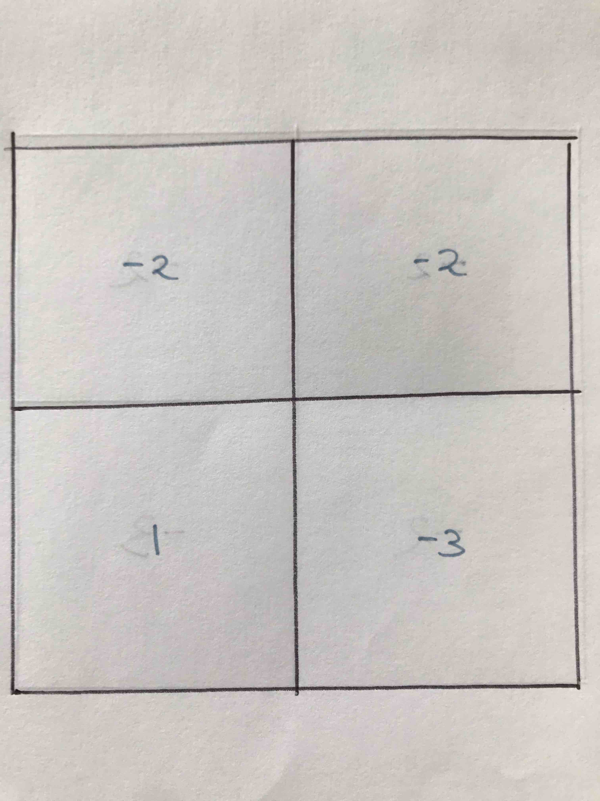

## Dungeon


[This](https://leetcode.com/problems/dungeon-game/) LeetCode problem

he demons had captured the princess (**P**) and imprisoned her in the bottom-right corner of a dungeon. The dungeon consists of M x N rooms laid out in a 2D grid. Our valiant knight (**K**) was initially positioned in the top-left room and must fight his way through the dungeon to rescue the princess.

The knight has an initial health point represented by a positive integer. If at any point his health point drops to 0 or below, he dies immediately.

Some of the rooms are guarded by demons, so the knight loses health (*negative* integers) upon entering these rooms; other rooms are either empty (*0's*) or contain magic orbs that increase the knight's health (*positive* integers).

In order to reach the princess as quickly as possible, the knight decides to move only rightward or downward in each step.

 

**Write a function to determine the knight's minimum initial health so that he is able to rescue the princess.**

For example, given the dungeon below, the initial health of the knight must be at least **7** if he follows the optimal path `RIGHT-> RIGHT -> DOWN -> DOWN`.

### Solution

Consider the following 2x2 map




Now from this map imagine you had another dungeon consisting of only 1 single cell, this cell is colored yellow:


You see that for this single cell map, the lowest health you can still such that you  still survive is **4**, since just staying in that cell will give a **-3** penalty.

Now consider another dungeon, this time a 1x2 like the one in yellow:


You already know that for right most yellow cell, the lowest health you can have is **4** no matter what. Now, for the leftmost yellow cell, the least you need is **3**, since this would become 3+1 -3 = 1. This you can compute as ``max{1, cell[i, j+1] - cell[i, j]}``.

Now consider a dungeon consisting of 2 cells like this:


Once again, you use the formula in the lowest health you need in order to reach the lower right corner is 6. Since 6 -2 -3 = 1.

Finally consider a dungeon with 4 cells like this one:


You see here the lowest health you need is **5**, which correspond to moving first down and the right.

You can calculate this as ``min( max(1, cell[i+1,j], - cell[i,j]), max(1,cell[i,j+1] - cell[i,j] ))``

Ok, now we have a recurrence.

So the code will be:

```python
class Solution:
      
    def calculateMinimumHP(self, dungeon: List[List[int]]) -> int:
        memo = {}
        
        def dp(i,j):
            if (i,j) in memo:
                return memo[(i,j)]
            
            if i >= len(dungeon) or j >= len(dungeon[0]): 
                return float("inf")

            if i == len(dungeon)-1 and j == len(dungeon[0])-1: 
                return max(1, 1-dungeon[i][j])
            
            memo[(i, j)] = min(max(1, dp(i + 1, j) - dungeon[i][j]),
                   max(1, dp(i, j + 1) - dungeon[i][j]))
            
            return memo[(i, j)]
        
        return dp(0, 0)    
```


