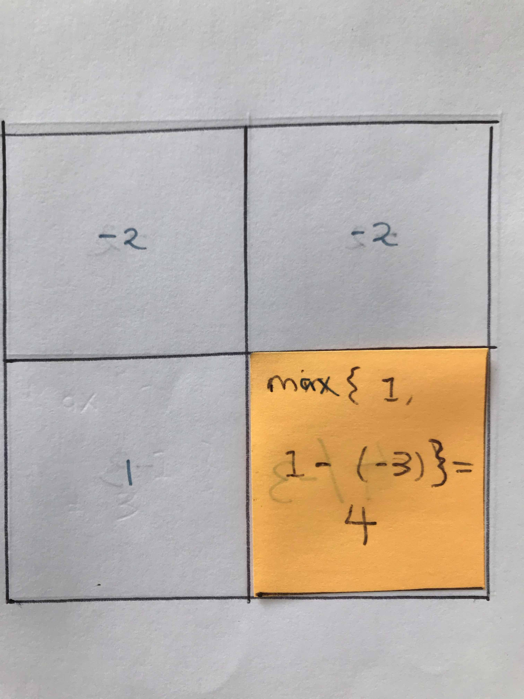
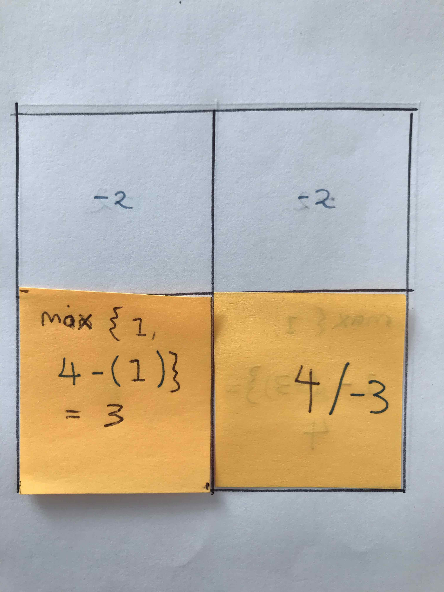
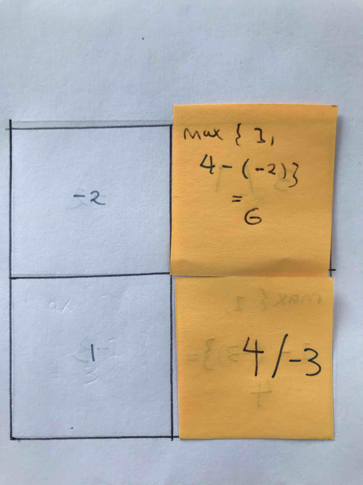

Consider the following 2x2 map

Now from this map imagine you had another dungeon consisting of only 1 single cell, this cell is colored yellow:

You see that for this single cell map, the lowest health you can still such that you  still survive is **4**, since just staying in that cell will give a **-3** penalty.

Now consider another dungeon, this time a 1x2 like the one in yellow:

You already know that for right most yellow cell, the lowest health you can have is **4** no matter what. Now, for the leftmost yellow cell, the least you need is **3**, since this would become 3+1 -3 = 1. This you can compute as ``max{1, cell[i, j+1] - cell[i, j]}``.

Now consider a dungeon consisting of 2 cells like this:

Once again, you use the formula in the lowest health you need in order to reach the lower right corner is 6. Since 6 -2 -3 = 1.

Finally consider a dungeon with 4 cells like this one:

You see here the lowest health you need is **5**, which correspond to moving first down and the right.

You can calculate this as ``min( max(1, cell[i+1,j], - cell[i,j]), max(1,cell[i,j+1] - cell[i,j] ))``

Ok, now we have a recurrence.

